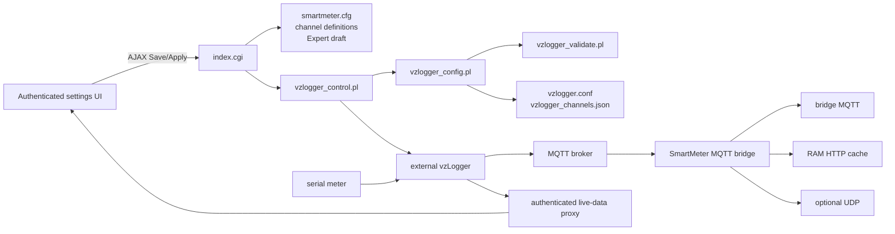

# Architecture Review

- **Review date:** 2026-07-31
- **Baseline:** `master` at `97b8d9fe22fd79510568db8262dcef4c7ca1eba6`
- **Remote state:** local `master`, `origin/master`, and the fetched `origin/master` were identical
- **Method:** static architecture and dependency review plus the locally available regression suite
- **Scope:** runtime code, authenticated and public web endpoints, browser code, lifecycle hooks, tests, and developer/user contracts

## Executive Summary

The plugin has a viable architecture for its LoxBerry constraints. Its principal
runtime boundaries are correct and match the normative product contract:

- vzLogger alone reads meters and publishes channel data.
- The SmartMeter bridge consumes MQTT and provides bridge MQTT, HTTP cache, and
  optional UDP output.
- Persistent desired state, temporary service actions, generated runtime
  configuration, and browser-only live history are separate concepts.
- Mutating web and lifecycle paths use shared locking, sensitive files use
  restrictive modes, and generated files are promoted atomically.
- The channel-definition document and the applied bridge mapping have distinct,
  documented responsibilities.

No P0 issue was found. One P1 correctness issue was found: the two service-status
implementations have already drifted. A service-action response omits
`config.mqtt_timestamp`; the Expert Mode UI interprets the missing property as
`false` and can clear the unsaved bridge-MQTT selection. This is direct evidence
that the duplicated status policy is no longer only a maintainability concern.

The main structural risk is concentration rather than an unsuitable technology
choice. `index.cgi`, `vzlogger_control.pl`, and `smartmeter-settings.js` each
coordinate several independently changing concerns. The recommended direction
is incremental extraction into existing-style Perl modules and plain JavaScript
files. A new framework, object hierarchy, build system, or broad directory
reorganization would add more risk than value.

## Rating

| Priority | Meaning |
|---|---|
| P0 | Immediate security, data-loss, or availability risk |
| P1 | Confirmed significant correctness problem or high change risk |
| P2 | Material maintainability/testability risk with a clear failure mode |
| P3 | Useful opportunistic improvement |

| ID | Priority | Area | Finding |
|---|---:|---|---|
| AR-01 | P1 | Service-status contract | Duplicated response builders have drifted and can alter Expert Mode UI state |
| AR-02 | P2 | Web architecture | `index.cgi` is the web controller, application service, persistence layer, and runtime orchestrator |
| AR-03 | P2 | Domain/persistence logic | Generator and web controller duplicate configuration, JSONC, discovery-cache, and OBIS helper logic |
| AR-04 | P2 | Browser architecture | The settings script combines several workflows and duplicates part of the Perl channel model |
| AR-05 | P2 | Runtime control | Service policy, system integration, recovery, and diagnostics are coupled in one CLI script |
| AR-06 | P3 | Module cohesion | The channel module combines several related but independently changing responsibilities |
| AR-07 | P3 | Architecture documentation | Contracts are strong, but no maintained developer component/data-flow overview exists |

## Current Architecture

### Components and responsibilities

| Component | Current responsibility | Assessment |
|---|---|---|
| `webfrontend/htmlauth/index.cgi` | Settings page, AJAX dispatch, persistence, validation orchestration, service actions, Expert Mode, recovery settings, I/R scan, and OBIS discovery | Correct entry point, overly broad application role |
| `bin/vzlogger_config.pl` | Generate `vzlogger.conf`, active channel mapping, and initial channel-definition state | Correct generator boundary; contains duplicated helpers |
| `bin/vzlogger_validate.pl` | Validate generated or Expert configuration and mapping | Good explicit validation boundary |
| `bin/vzlogger_control.pl` | Apply/promote configuration, control services, recovery, installation helpers, status, and diagnostics | Stable external CLI, overly broad implementation |
| `bin/vzlogger_mqtt_bridge.pl` | Subscribe to effective channel topics and drive bridge outputs | Correct runtime boundary |
| `bin/SmartMeterVZLogger*.pm` | Reusable channel, bridge, configuration, Expert, HTTP, status, and atomic-runtime logic | Good direction; extraction is incomplete |
| `service_status.cgi`, `obis_status.cgi`, `vzlogger_live_data.cgi` | Lightweight authenticated polling endpoints | Good pattern; shared policy is not consistently centralized |
| `smartmeter-settings.js` | All settings-page interactions and AJAX workflows | Functional but concentrated |
| `vzlogger_live.js` | Pure live-chart model plus browser storage, polling, table, and chart adapter | Large, but already has a useful UMD test seam |
| Lifecycle hooks and `sbin/` helpers | Install, upgrade, uninstall, permissions, service units, and shared lock integration | Appropriate LoxBerry layout and privilege boundary |

### Primary data flow



`vzlogger_channel_definitions.json` remains the authoritative UI document for
active and inactive definitions. `vzlogger_channels.json` contains only applied,
active plugin outputs for the bridge. This separation is intentional and should
not be collapsed during refactoring.

### Change hotspots

The counts below are physical lines and named `sub`/`function` declarations. They
are indicators for review focus, not quality thresholds.

| File | Lines | Named routines | Main concerns |
|---|---:|---:|---|
| `webfrontend/htmlauth/index.cgi` | 3,187 | 141 | dispatch, rendering, persistence, discovery, services, recovery |
| `bin/vzlogger_control.pl` | 1,416 | 64 | policy, service I/O, recovery, diagnostics |
| `webfrontend/htmlauth/smartmeter-settings.js` | 1,361 | 99 | service/config actions, discovery, editor, recovery |
| `webfrontend/htmlauth/vzlogger_live.js` | 1,169 | 90 | model, IndexedDB, polling, rendering |
| `bin/vzlogger_config.pl` | 628 | 34 | generation plus duplicated input/cache helpers |
| `bin/vzlogger_mqtt_bridge.pl` | 598 | 26 | long-running process and output adapters |
| `bin/SmartMeterVZLoggerChannels.pm` | 509 | 29 | OBIS, catalog, document, validation, ordering, JSON I/O |

The repository contains 51 runtime/template assets in the reviewed extensions,
including nine Perl modules, four Perl executables, nine authenticated CGI
endpoints, and 22 test files.

## Detailed Findings

### AR-01 — Service-status responses have incompatible schemas

- **Priority:** P1
- **Type:** confirmed correctness defect caused by duplication

The lightweight endpoint includes `config.mqtt_timestamp`
(`webfrontend/htmlauth/service_status.cgi:45-55`). The status builder in the main
controller does not include that property
(`webfrontend/htmlauth/index.cgi:737-746`), although its local
`generated_config_status` calculates the value
(`webfrontend/htmlauth/index.cgi:1039-1063`).

Service actions return the main controller's status response
(`webfrontend/htmlauth/index.cgi:807-809`). The browser then unconditionally
assigns:

```text
expert_mqtt_timestamp = !!response.config.mqtt_timestamp
```

(`webfrontend/htmlauth/smartmeter-settings.js:121-134`). A missing property
therefore becomes `false`. `update_all_control_states` subsequently disables the
bridge-MQTT control and programmatically sets its unsaved value to `0`
(`smartmeter-settings.js:1024-1029`). Later polling normally requests
`details=0` once a snapshot exists (`smartmeter-settings.js:146-153`), so the
detailed property is not automatically restored.

**Impact**

- In Expert Mode, Start, Stop, or Restart can make the page claim source
  timestamps are unavailable even when the applied configuration enables them.
- The UI can clear an unsaved bridge-MQTT selection. A later Save/Apply can then
  persist the unintended value.
- This conflicts with the state-preserving AJAX contract in `SM-UI-006` and
  `SM-UI-007`.

**Recommendation**

1. Fix the immediate response by including `mqtt_timestamp` in every detailed
   status response.
2. Move generated-config status, Expert status, service-state classification,
   and response construction into one reusable Perl module consumed by
   `index.cgi` and `service_status.cgi`.
3. Define one response-shape contract test that exercises both callers and
   verifies property names, booleans, and start/restart gating.
4. Make the browser retain the previous value when an optional property is
   absent instead of treating absence as `false`.

**Estimated change:** small to medium. The immediate fix is small; centralizing
the complete builder is a separate low-risk extraction.

### AR-02 — The authenticated controller has too many responsibilities

- **Priority:** P2
- **Type:** change concentration and testability risk

`index.cgi` has 3,187 lines and 141 named routines. In one process it:

- loads the template and translations;
- authenticates mutating AJAX actions and acquires the configuration lock;
- dispatches nine AJAX operations;
- reads, normalizes, validates, and saves configuration;
- renders all settings and reader rows;
- manages Expert drafts and promotion;
- builds service status and invokes service control;
- manages recovery configuration;
- scans I/R devices;
- launches, monitors, cancels, and restores OBIS discovery;
- manages pending reader/channel artifacts and discovery caches;
- locates logs and produces AJAX response formats.

The code already demonstrates the preferred alternative: security, channel
logic, Expert parsing, atomic promotion, HTTP access, and OBIS status have been
extracted into small modules. Further extraction should continue that pattern.

**Impact**

- A change to one workflow requires loading and reasoning about unrelated
  global state such as `$q`, `$plugin_cfg`, `%L`, and cached documents.
- Most controller behavior cannot be imported and unit-tested without executing
  CGI initialization.
- Duplicate lightweight endpoints emerge because importing the controller is
  impractical; AR-01 is the resulting failure mode.

**Recommendation**

Keep `index.cgi` as the single authenticated page and compatibility entry point,
but reduce it to request setup, authorization, dispatch, and template rendering.
Extract in this order:

1. service snapshot/status policy;
2. configuration value access and shared meter/JSONC helpers;
3. discovery cache and discovery job orchestration;
4. recovery settings persistence.

Each extracted module should accept explicit configuration, paths, request data,
and language callbacks. It should not introduce a dependency-injection
framework or a class hierarchy.

**Estimated change:** medium, delivered in independent commits with unchanged
CGI routes and response shapes.

### AR-03 — Web and generator paths maintain parallel domain logic

- **Priority:** P2
- **Type:** semantic duplication

The following logic exists separately in `index.cgi` and
`vzlogger_config.pl`:

- scalar configuration reads and optional value setters
  (`index.cgi:2320-2375`, `vzlogger_config.pl:240-277`);
- complete JSONC meter parsing and structural validation
  (`index.cgi:2399-2436`, `vzlogger_config.pl:279-311`);
- the fallback default-channel list
  (`index.cgi:2702-2720`, `vzlogger_config.pl:377-395`);
- custom-channel parsing, discovery-cache file naming and reading, and OBIS
  ordering (`index.cgi:2674-2759,2861-2948`,
  `vzlogger_config.pl:518-627`);
- integer/boolean normalization (`index.cgi:2472-2491`,
  `vzlogger_config.pl:468-479`, with another canonical implementation in
  `SmartMeterVZLoggerConfig.pm:10-16,119-124`).

Most copies are currently equivalent, and the regression suite passes. Their
existence nevertheless permits the UI preview/draft path and the actual
generator to interpret the same saved data differently.

**Impact**

- New protocol fields or validation rules must be changed in several locations.
- UI validation can accept input that generation rejects, or render a
  differently ordered/discovered set than generation applies.
- Localized errors make it tempting to duplicate validation instead of
  returning structured error codes from one canonical validator.

**Recommendation**

- Introduce one small meter-input module for JSONC parsing, structural
  validation, configuration scalar access, and protocol-neutral optional field
  construction.
- Move discovery-cache naming/reading/sorting into a shared module that accepts
  the configuration directory explicitly.
- Return structured validation results; keep localization in `index.cgi`.
- Derive fallback metadata from the existing OBIS catalog or define the
  fallback list once in a data file/module.
- Remove copies only after parity tests cover both the draft and applied
  generator paths.

**Estimated change:** medium. Start with exact-copy helpers; defer broader model
changes.

### AR-04 — Settings-page behavior is concentrated and partially duplicates Perl

- **Priority:** P2
- **Type:** browser maintainability and contract risk

`smartmeter-settings.js` contains 1,361 lines and 99 named functions. It manages
recovery settings, service polling/actions, Save/Apply/validation, debug-log
navigation, I/R scanning, OBIS jobs, the complete channel editor, Expert Mode,
and global enable/disable policy.

The channel editor also independently implements OBIS parsing, catalog lookup,
default output-key creation, uniqueness, and output-key validation
(`smartmeter-settings.js:680-712`). The canonical Perl equivalents are in
`SmartMeterVZLoggerChannels.pm:78-145`. Current tests thoroughly exercise the
Perl model, while the settings-page tests mostly assert source patterns. There
are no behavioral JavaScript tests for these duplicated channel functions.

**Impact**

- A channel-model change can produce different client and server behavior.
- Global variables and cross-workflow timers make isolated failure/retry cases
  difficult to test.
- Source-regex tests can verify that code text exists without proving the
  browser state transition is correct; AR-01 is not detected by the current
  suite.

**Recommendation**

- Keep plain JavaScript and the existing no-build deployment.
- First extract pure channel functions into a UMD-style module, following the
  existing `SmartMeterLive` pattern, and test it with Node.
- Use shared input/output fixtures to prove Perl/JavaScript parity for OBIS
  normalization, default keys, allowed characters, storage `255`, and duplicate
  key suffixes.
- Then separate service/configuration actions, device/discovery workflows, and
  the channel editor into files with explicit exported namespaces.
- Preserve current AJAX routes, DOM IDs, unsaved state, and deferred rendering.

**Estimated change:** medium, suitable for several behavior-preserving steps.

### AR-05 — Runtime policy and operating-system integration are intertwined

- **Priority:** P2
- **Type:** testability and privileged-boundary maintenance

`vzlogger_control.pl` is intentionally the stable CLI and privilege-facing
entry point, but its 1,416 lines and 64 routines implement several layers:

- action dispatch and user-facing CLI messages;
- configuration generation, validation, staging, and promotion;
- desired-state and service-start eligibility policy;
- systemd start/stop/restart/autostart operations;
- bridge and vzLogger service-helper installation;
- OBIS-discovery process cleanup;
- recovery policy and state reporting;
- debug bundle construction and bounded MQTT capture;
- LoxBerry logging and privilege escalation.

The privileged shell helpers and exact sudo surface are appropriately narrow.
The problem is not the single executable interface; it is that pure decisions
and operating-system commands are implemented together. Controller/lifecycle
tests consequently rely heavily on regular-expression assertions over source
text rather than executing policy branches.

**Impact**

- Changes to desired-state or recovery rules are difficult to exercise without
  systemd and a LoxBerry filesystem.
- Static assertions are coupled to implementation spelling and can pass while
  runtime composition is wrong.
- Diagnostic growth increases the review surface of service-control changes.

**Recommendation**

- Preserve all current command names and the single `vzlogger_control.pl`
  executable.
- Extract pure service eligibility, expected-state, and recovery decisions into
  a module returning structured decisions.
- Wrap systemd/helper execution behind small functions that accept a command
  runner, allowing deterministic tests without changing production commands.
- Move diagnostic report assembly and MQTT capture into a separate module only
  after policy extraction.
- Keep the existing root-owned `sbin/` helpers and exact sudoers commands.

**Estimated change:** medium to large, but independently stageable.

### AR-06 — The channel module has multiple axes of change

- **Priority:** P3
- **Type:** cohesion improvement

`SmartMeterVZLoggerChannels.pm` is a useful canonical domain module, but its 509
lines cover:

- OBIS parsing, normalization, formatting, and catalog matching;
- UUID generation;
- JSON file I/O;
- channel-document initialization and validation;
- localized validation messages;
- native vzLogger channel generation;
- output ordering for cache/UDP.

These concerns are related, so an immediate split is not required. The current
module is substantially better than duplicating all behavior in entry points.
However, it is now imported by the web controller, generator, validator,
bridge, live page, and custom-channel module, so unrelated changes affect a
wide dependency surface.

**Recommendation**

When AR-03 or AR-04 requires changes here, separate stable OBIS/catalog
semantics from channel-document persistence/validation. Keep existing exported
functions as compatibility wrappers during the transition. Do not split solely
to reduce line count.

**Estimated change:** small to medium when combined with an already required
change; otherwise defer.

### AR-07 — Architecture knowledge is distributed across contracts

- **Priority:** P3
- **Type:** documentation maintainability

`developer-requirements.md` is a strong normative contract, and the user output
guides explain the data flow. Before this review, the developer documentation
did not provide one component map showing entry points, persistent/runtime
artifacts, process boundaries, and dependency direction.

**Impact**

- Reviewers must reconstruct architecture from requirements, user guides,
  tests, and code.
- A large file can be mistaken for the architecture itself rather than an entry
  point containing several application services.

**Recommendation**

Treat this report as a dated snapshot, not a permanent normative contract. When
the first extraction is implemented, add a short maintained
`docs/development/architecture.md` containing only the stable component map,
artifact ownership, and critical flows. Keep behavioral rules in
`developer-requirements.md`.

## Positive Findings

- **Correct process boundary:** the bridge consumes MQTT and does not read
  serial devices, matching `SM-ARCH-001` and `SM-ARCH-002`.
- **Explicit state semantics:** `VZLOGGER.ENABLED` is separated from temporary
  Start/Stop/Restart actions.
- **Atomicity and locking:** web mutations use
  `SmartMeterVZLoggerRuntime`; lifecycle hooks use the shell lock helper; staged
  runtime artifacts are promoted together.
- **Security:** mutating AJAX requests are POST/CSRF protected, recovery tokens
  are hash-only, configuration viewers are authenticated, and secret handling
  is explicitly tested.
- **Privilege separation:** root-owned `sbin/` helpers and exact sudoers entries
  avoid executing plugin-writable scripts through a privileged shell.
- **Data ownership:** channel definitions, applied mapping, Expert draft,
  generated configuration, discovery cache, and RAM runtime files have distinct
  purposes.
- **Lightweight polling:** service, OBIS, and live-data polling use dedicated
  endpoints rather than repeatedly rendering the full settings page.
- **Good pure-code seams:** bridge calculations, channel validation, Expert
  parsing, HTTP parsing/caching, runtime promotion, CSRF, and live-chart
  compaction have independently testable functions.
- **No unnecessary framework:** the current Perl/CGI/plain-JavaScript approach
  fits the package layout and deployment constraints.

## Verification and Coverage Assessment

### Executed locally

| Check | Result |
|---|---|
| All Perl `.pl`, `.pm`, and `.cgi` syntax via `tools/check-perl-syntax.ps1` | PASS |
| 19 Perl regression files through `prove` | PASS — 1,033 assertions |
| `tests/test_vzlogger_live.js` with bundled Node.js | PASS |
| `tools/validate-release-metadata.pl --channel development` | PASS |
| `tests/test_deploy_line_endings.ps1` | PASS |

PHP syntax and POSIX-shell syntax were not rerun locally because `php` and
`bash` were unavailable in this Windows environment. Both checks are defined in
`.github/workflows/syntax-check.yml`; this review does not claim a fresh local
result for them. No test-device deployment or authenticated browser acceptance
was performed because this was a review/documentation task and did not change
installed behavior.

### Coverage strengths

- Channel model, generator, validator, bridge parsing/calculation, Expert Mode,
  HTTP cache, runtime promotion, web security, and live-chart model have
  executable regression tests.
- Lifecycle, language parity, release metadata, documentation links, and
  privilege contracts have broad static checks.
- Generator tests use temporary paths and environment seams rather than
  modifying user configuration.

### Coverage gaps

- The service-status response schema is not tested across both producers.
- Settings-page state transitions are not executed in a DOM/browser test; most
  UI tests inspect source text.
- Controller and lifecycle policy is often verified through regex rather than
  executable decision tests.
- No current test measures dependency direction, duplicated domain helpers, or
  file-level complexity. Such metrics should inform review, not become rigid
  pass/fail limits.
- Target-system service, ownership, and responsive-browser acceptance remains
  necessary for implementation changes affecting installed behavior.

## Recommended Roadmap

### 1. Correctness first

- Fix AR-01 without changing endpoint URLs or unrelated UI behavior.
- Add a service-status schema/parity test and an Expert Mode browser-state unit
  test.

### 2. Low-risk shared modules

- Centralize service snapshot construction.
- Extract exact-copy configuration, JSONC, and discovery-cache helpers.
- Add parity tests before deleting duplicate implementations.

### 3. Browser seams

- Extract the pure channel model and add Node contract tests against shared
  vectors.
- Split settings workflows while preserving DOM IDs, AJAX behavior, and
  unsaved state.

### 4. Runtime policy seams

- Extract pure service/recovery decisions from `vzlogger_control.pl`.
- Add command-runner-backed tests, then consider separating diagnostics.

### 5. Opportunistic cleanup

- Revisit `SmartMeterVZLoggerChannels.pm` cohesion only when related behavior is
  already changing.
- Create a concise maintained architecture reference after the first extraction
  establishes the intended boundaries.

## Review Constraints

- This is a static and local-test review of one commit, not representative-meter
  or target-platform evidence.
- Line and function counts identify concentration; they are not automatic
  refactoring requirements.
- The review intentionally favors small, compatible extractions over Clean
  Architecture layers, classes, a web framework, or a JavaScript build chain.
- Stable plugin identity, metadata, CLI actions, CGI URLs, configuration keys,
  stored user data, file modes, and lifecycle behavior must remain compatible.
