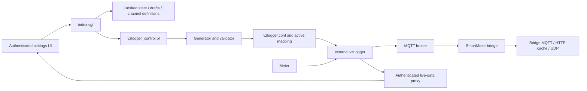

# SmartMeter v2 Architecture

This document is the maintained component and data-flow map. Normative behavior
is defined in [developer requirements](developer-requirements.md); this overview
does not duplicate those rules.

## Process boundaries

| Component | Responsibility |
|---|---|
| Authenticated CGI endpoints | Authenticate requests, acquire the shared mutation lock, dispatch workflows, and render or return JSON |
| `SmartMeterVZLogger*.pm` modules | Validate and transform configuration, channel, status, discovery, recovery, service-policy, and diagnostic data |
| `vzlogger_config.pl` / `vzlogger_validate.pl` | Generate a staged runtime configuration and validate the coherent configuration/mapping pair |
| `vzlogger_control.pl` | Preserve the stable CLI, translate policy decisions into exact privileged helper/systemd actions, and report observed final states |
| external vzLogger | Read meters and publish configured channel data to MQTT |
| SmartMeter bridge | Subscribe to applied channel topics and independently provide bridge MQTT, RAM-backed HTTP cache, and optional UDP output |
| Browser modules | Preserve form state and coordinate service, discovery, channel-editor, and live-history workflows without a build step |

The CGI and CLI entry points depend on the modules. Domain and policy modules do
not depend on CGI globals, localized strings, systemd, or production filesystem
paths. Operating-system calls remain at the CLI/endpoint edge and accept test
seams where deterministic execution is required.

## Artifact ownership

| Artifact | Owner and purpose |
|---|---|
| `smartmeter.cfg` | Persistent desired state and standard-editor settings |
| `vzlogger_expert.conf` | Persistent Expert Mode draft; invalid drafts remain available for correction |
| `vzlogger_channel_definitions.json` | Authoritative browser/UI document for active and inactive channel definitions |
| `vzlogger.conf` + `vzlogger_channels.json` | Atomically promoted applied runtime configuration and active bridge mapping |
| `vzlogger_user_channel_uuids_*.json` | Stable custom-channel UUID registry |
| `obis_channels_*.cache` and pending files | Discovery results and browser-visible, not-yet-applied selections |
| `/var/run/shm/<plugin>/` | Lock, discovery status, live proxy cache, bridge cache, and other disposable runtime state |

Generated artifacts are staged and validated together before promotion. Browser
history remains browser-local and is not written to the LoxBerry filesystem.

## Critical flows

Service polling uses the lightweight status endpoint and the same shared status
builder as service-action responses. Discovery runs independently of the page
request, records its state in RAM, preserves successful results across restore
warnings, and restores the prior vzLogger state. Recovery uses pure eligibility
policy before issuing any systemd command and never installs or enables units.
